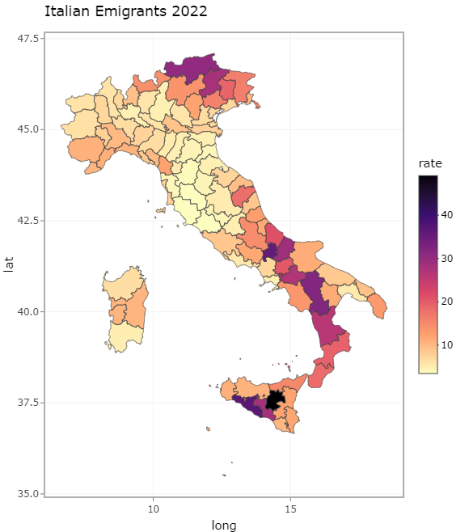

# Italian emigrants 2022

This is a data visualization project showing italians living/moving abroad in 2022. 

The data were collected by A.I.R.E ("Anagrafe Italiani Residenti all'Estero") and the dataset was downloaded from the official minister [website](http://ucs.interno.gov.it/ucs/contenuti/Anagrafe_degli_italiani_residenti_all_estero_a.i.r.e._int_00041-8067961.htm) (you could also find a copy of the dataset in this repository).

Another source of data was the Wikipedia's page of the italian subregions ([province](https://it.wikipedia.org/wiki/Province_d%27Italia)), the table data was web-scraped using the library `rvest`. This second dataset was useful for calculating the rate of emigrants for each subregion and also to uniform the data. Indeed the primary dataset from AIRE is semi-structered and some data wrangling was necessary to extract the informations correctly. 

When using different dataset it's important to standardize the records (in this case the subregions, "province"),
indeed we can have different way to call a city, also typos could occur. In order to gather succesfully the two source of data I've minimized the distance between the strings with the `adist` function to find the best match. After the matching it's possible to create the new "rate" variable. 

The ultimate JOIN is between the geographical coordinates, extracted with the library `map`, and the new dataset obtained in the last step. 
Now it's possible to plot it!

(for more detailed information see the R script above)

## Instructions

The "italian_emigrants22.R" is a reproducible code, written in R language, that only needs in input the AIRE dataset.
Just pay attention that all the packages are correctly installed on your device and that you've settled the path where the AIRE dataset is. 
The plot is in the "Viewer" not in "Plots", because it's an interactive graph made with `plotly`. 

Disclaimer:this aren't official statistics because I've decided to use the Wikipedia's data, as proxy of the total number of population of each subregions,
and I haven't used a more certified source of data of the same year. However the results slightly differs. 

